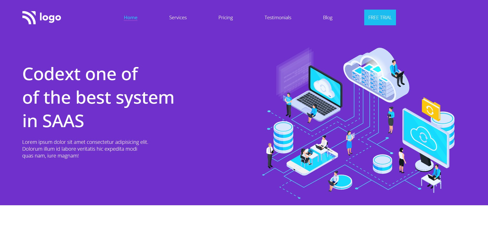

# Full Stack Javascript Bootcamp Assignment 

# Live Project 13 : SAAS Landing Page

## Project 13: (Mobile Responsive)
[Live Link](https://live-project-13-fs-js.netlify.app/)

-   Skills Gained in this project.
    - Learned to use add shadows to the card,using border-radius top add top curves to elements.
    - Created cards for displaying contents in better formats.
    - Modified color of svg images.
        
---

## Time taken to finish this project(including adding media queries)⏲

- >Around 4 hours.

#### Screenshot

